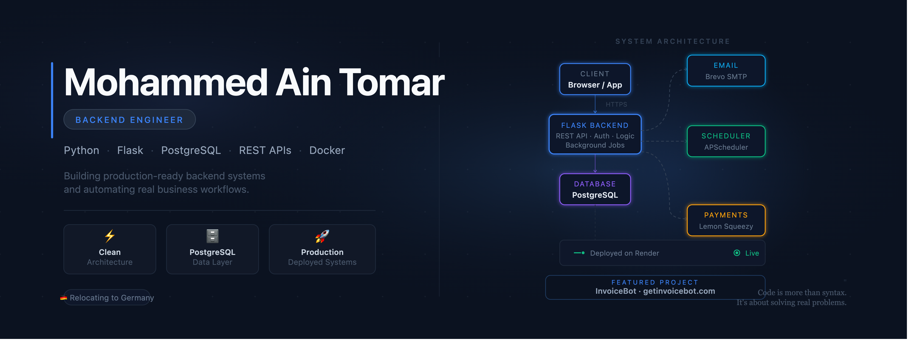

<div align="center">
  
</div>

<br/>

I'm a backend engineer based in Morocco, building production software with Python, Flask, and PostgreSQL.

My focus is on systems that do real work — automated workflows, scheduled jobs, payment lifecycles, REST APIs that handle actual business logic. I'm not interested in tutorial projects. Every system I build is deployed and running.

I'm currently preparing to relocate to Germany, where I intend to work as a backend engineer and keep building.

---

## What I've built

**[InvoiceBot](https://getinvoicebot.com)** — A production SaaS that automates invoice reminder workflows for small businesses. Handles scheduling, email delivery, subscription billing, and payment webhooks without manual intervention. Built with Flask, PostgreSQL, APScheduler, Brevo SMTP, and Lemon Squeezy. Live.

**[Portfolio](https://github.com/Mohammed18-19/Portfolio)** — Personal site built to practice frontend integration alongside backend work.

---

## Stack

```
Python · Flask · PostgreSQL · SQLAlchemy
REST APIs · JWT · APScheduler
Linux · Docker · Git · Render
```

---

## Where I'm going

I'm deepening my understanding of how backend systems behave under real conditions — query performance, job reliability, deployment architecture, failure modes. I want to work on systems where those things matter.

TELC B1 German certified (June 2026). Targeting B2. Open to backend engineering roles and Ausbildung Fachinformatiker Anwendungsentwicklung in Germany from 2026.

---

<div align="center">

[](mailto:aintomar.mohammed200@gmail.com)
[](https://linkedin.com/in/mohammed-ain-tomar)
[](https://getinvoicebot.com)

</div>